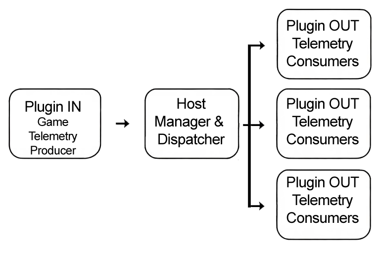

# OpenSR SDK 1.0 Architecture Overview

## 1. Execution Model



OpenSR is built around a **host-driven plugin system** with two distinct plugin categories:

- **IN Plugins (Game plugins)** → produce telemetry
- **OUT Plugins (Device / Output plugins)** → consume telemetry and produce inputs

These two categories are managed differently by the host.

### Common Plugin Interface

```cpp
#include <string>
#include <functional>
#include "OpenSRContext.h"

#define OpenSR_PLUGIN_API extern "C" __declspec(dllexport)

#define PLUGIN_TYPE_NONE -1
#define GAME_PLUGIN_TYPE 0
#define OUT_PLUGIN_TYPE 1

// Check if we are compiling with VS2010 (Ver 1600) or older
#if defined(_MSC_VER) && (_MSC_VER <= 1600)
    // VS2010: Does not support "= default"
    #define OSR_DTOR_BODY {}
    #define OSR_NOEXCEPT
#else
    // Modern VS (2015+): Use modern C++ standards
    #define OSR_DTOR_BODY = default;
    #define OSR_NOEXCEPT noexcept
#endif 
namespace osr {
    enum OpenSRContextChange
    {
        ProfilePathChanged,
        SettingsChanged,
        FullContextReloaded,
        CheckDevice
    };


    class IOpenSRPlugin {
    public: 
        virtual ~IOpenSRPlugin() OSR_DTOR_BODY

        // Called immediately after game is detected to provide setup and shared data access
        virtual bool Init(OpenSRContext* context, void* buffers, const wchar_t* pluginPath) = 0;

        // Called to start processing. This should be a NON-BLOCKING call.
        // The plugin should start its work in a separate thread.
        virtual bool Start() = 0;

        // Called to request the plugin to pause its processing
        virtual void Pause() = 0;

        // Called to request the plugin to resume its processing
        virtual void Resume() = 0;

        // Returns true if the plugin's main processing loop is active.
        // This is used by the manager to detect if the plugin has terminated unexpectedly.
        virtual bool IsRunning() const = 0;

        // Called to request the plugin to stop its processing (join threads)
        virtual void Stop() = 0;

        // Called before unloading to cleanup
        virtual void Shutdown() = 0;

        // Returns generic pointer. 
        // Host sees void*, Plugin UI casts it to SharedData* later.
        virtual uint64_t GetSharedPointer() {
            return 0;
        }

        // metadata
        virtual void GetPackageName(char* buffer, size_t bufferSize) const = 0;   // e.g. "com.author.outplugin.slipro" or "com.company.gameplugin.rfactor2"
        virtual void GetPluginName(char* buffer, size_t bufferSize) const = 0;
        virtual void GetAuthor(char* buffer, size_t bufferSize) const = 0;
        virtual void GetVersion(char* buffer, size_t bufferSize) const = 0;
        virtual void GetLicenseType(char* buffer, size_t bufferSize) const = 0;
        virtual void GetDescription(char* buffer, size_t bufferSize) const = 0;
        virtual void GetTargetName(char* buffer, size_t bufferSize) const = 0;
        virtual void GetTargetProcessName(char* buffer, size_t bufferSize) const = 0;

        virtual void GetPluginGroupName(wchar_t* buffer, size_t bufferSize) const = 0;

        virtual bool IsBackend() const { return false; }

        virtual int GetType() = 0;

        virtual bool IsCheckingAllowed() { return false; }

        virtual void CheckDevice() {}

        // reload notification
        virtual void OnContextChanged(osr::OpenSRContextChange reason)
        {
            // Default: do nothing
        }

        // Optional: Set UI TAB Name (Default 'Plugin')
        virtual void GetUITabName(char* buffer, size_t bufferSize) const
        {
            strncpy_s(buffer, bufferSize, "Plugin", _TRUNCATE);
        }

        // Optional: Set Settings TAB Name (Default 'Settings')
        virtual void GetSettingsTabName(char* buffer, size_t bufferSize) const
        {
            strncpy_s(buffer, bufferSize, "Settings", _TRUNCATE);
        }
    };

}

// Mandatory exported factory function for the loader
typedef osr::IOpenSRPlugin* (*CreatePluginFunc)();
typedef void (*DestroyPluginFunc)(osr::IOpenSRPlugin*);

OpenSR_PLUGIN_API osr::IOpenSRPlugin* CreatePlugin();
OpenSR_PLUGIN_API void DestroyPlugin(osr::IOpenSRPlugin* plugin);
```

---

## 2. OUT Plugins Lifecycle (Device / Output)

OUT plugins are **fully managed at application level**.

### Lifecycle sequence:

1. **Load**
2. **Init(…)**
3. **Start()**
4. Runtime (plugin-owned thread loop)
5. **Stop()**
6. **Shutdown()**
7. **Destroy / Unload**

### Key characteristics:

- Always loaded when OpenSR starts (unless disabled)
- Run **independently of any game**
- Responsible for:
  - Their own **thread loop**
  - Writing **input data** (InSimData)
  - Reading **telemetry data** (OutSimData)

There is **no central loop for OUT plugins** — they are autonomous once started.

---

## 3. IN Plugins Lifecycle (Game Plugins)

IN plugins are **managed dynamically by the Game Manager**.

### Host behavior:

- All IN plugins are **loaded at startup**
- A **central Game Manager loop** continuously:
  - Monitors running processes
  - Matches them against plugin target executables

### Lifecycle sequence (per game detection):

1. **Init(…)**
2. **Start()**
3. Runtime (plugin-owned thread loop)
4. Game exits →
   - **Stop()**
   - **Shutdown()**

### Key characteristics:

- Only active when their **target game process is running**
- Must implement:
  - Game detection via `GetTargetProcessName`
- `IsRunning()` is actively checked by the host to ensure health

---

## 4. Threading Model

- **All plugins (IN and OUT)** are expected to:
  - Spawn and manage their own **worker thread(s)**
  - Start threads in `Start()`
  - Stop them cleanly in `Stop()`
- The host:
  - Does **not execute plugin logic loops**
  - Only orchestrates lifecycle and data exchange

---

## 5. Data Flow Architecture

### Core principle:

**IN → Host → OUT**

---

### Step-by-step flow:

#### 1. IN Plugin (Game)

- Writes telemetry into:
  - `OutSimData`
  - Optional `BlobData`
- Calls:`submitFrameCallback(userData);`

---

#### 2. Host Processing

- Receives frame submission
- Validates data
- Adds internal metadata (e.g., frame ID)
- Dispatches data to all active OUT plugins

---

#### 3. OUT Plugins

- Read from:
  - `OutSimData`
  - `BlobData`
- If applicable (device plugins):
  - Write into:
    - `InSimData` (inputs: buttons, axes, etc.)

---

#### 4. Input Propagation

- Host monitors `InSimData`
- When input changes:
  - Broadcasts updates to **all OUT plugins**

---

## 6. Shared Buffers Model

### IN Plugins access:

```
OpenSRBuffersIN
- OutSimData*   // write telemetry
- BlobData*     // optional custom data
```

### OUT Plugins access:

```
OpenSRBuffersOUT
- InSimData*    // write inputs
- OutSimData*   // read telemetry
- BlobData*     // read custom data
```

---

## 7. OpenSRContext Role

The context provides:

- Application state:
  - `isAppRunning`
  - `targetGamePId`
- Paths:
  - App folder
  - Documents folder
  - Current profile
- Frame submission:`void (*submitFrameCallback)(void* userData);`

This is the **only synchronization point** between IN plugins and the host.

```cpp
#pragma pack(push, 1)

struct OpenSRContext {
    uint8_t isAppRunning;                        // flag 1 if OpenSR running
    uint32_t targetGamePId;                        // current target process ID, 0 if N/A
    wchar_t osrAppFolder[MAX_PATH];                // OpenSR App folder path
    wchar_t osrDocFolder[MAX_PATH];                // .../Documents/OpenSR/ folder path
    wchar_t currentProfilePath[MAX_PATH];        // current loaded profile path
    uint64_t reserved[8];

    void (*submitFrameCallback)(void* userData); // Frame submission on new data
    void* userData;                                 // internal ref., do not modify
 };

#pragma pack(pop)
```

---

## 8. Central Loop Behavior

- **Present**:
  - Game detection (IN plugins)
  - Input monitoring (InSimData)
- **Not present**:
  - OUT plugin execution (fully autonomous)

---

## 9. Game Detection Logic

- Each IN plugin defines:`GetTargetProcessName()`
- Host:
  - Scans running processes
  - Starts plugin when match is found
  - Stops plugin when process exits

---

## 10. Pause / Resume Mechanism

The host provides a **global kill switch**:

- `Pause()` → plugins must suspend activity
- `Resume()` → plugins resume execution

### Requirement:

All plugins are expected to:

- Implement pause-safe thread behavior
- Avoid busy loops during pause

---

## 11. Disabled Plugins

- Completely excluded from:
  - Loading
  - Lifecycle execution
  - Data flow

Disable unused plugins (recommended).

---

## Resulting Model

- Host = **orchestrator + router**
- IN plugins = **telemetry producers (event-driven via callback)**
- OUT plugins = **consumers + input producers (continuous loops)**
