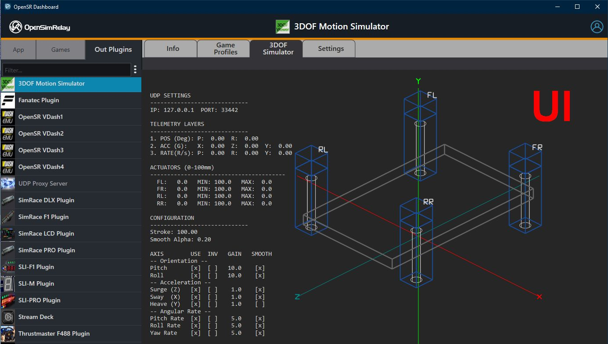
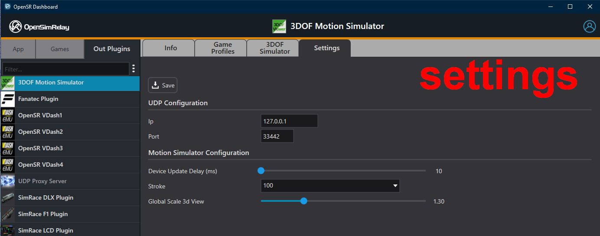

# Plugin UI & Settings System

## 1. Overview

[](assets/ui_plugin.jpg)

[](assets/settings_plugin.jpg)

OpenSR separates **runtime logic** from **user interface and configuration**. See the corresponding chapter 14 and 15 for more details on plugin implementation.

A plugin can optionally provide:

- a **Settings module** (`settings.dll`)
- a **UI module** (`ui.dll`)

These modules are:

- **independent from the core plugin binary**
- **loaded on demand by the dashboard**
- **fully optional**

A plugin remains valid and functional without them.

---

## 2. Plugin Type Identification

Each plugin defines its category using:

```
int GetType();
```

This returns:

- `GAME_PLUGIN_TYPE` → IN plugin
- `OUT_PLUGIN_TYPE` → OUT plugin

This determines:

- how the host manages lifecycle
- which buffers are exposed
- how the plugin participates in the data flow

---

## 3. UI & Settings Architecture

### Key principle:

UI and Settings are **not part of the runtime plugin lifecycle**

They are:

- **dashboard-driven**
- **user-triggered**
- **short-lived**

---

## 4. Lifecycle (UI & Settings)

Both `IPluginUI` and `IPluginSettings` follow the same lifecycle:

### When user opens the corresponding tab/page:

1. DLL is loaded
2. `CreatePluginUI()` / `CreatePluginSettings()`
3. `Initialize(...)`

### When user leaves the page or closes UI:

4. `Shutdown()`
5. `DestroyPluginUI()` / `DestroyPluginSettings()`
6. DLL is unloaded

---

## 5. IPluginSettings Interface

### Purpose:

Provide a **configuration interface** for the plugin. See the *Create a Settings Plugin* chapter for more details.

### Interface:

```cpp
#define _PLUGIN_SETTINGS_CHANGED  0x8410

class IPluginSettings {
public:
    virtual ~IPluginSettings() = default;

    virtual BOOL Initialize(
        HWND hWindow,
        OpenSRContext* context,
        void* buffersOut,
        const wchar_t* pluginFolderPath
    ) = 0;

    virtual BOOL Shutdown() = 0;

    virtual BOOL WantsDialogMessages() const { return FALSE; }
};
```

### Behavior:

- `Initialize(...)`
  - Receives a **child window handle**
  - Plugin renders its UI inside it
  - Has access to:
    - context
    - buffers
    - plugin folder
- `Shutdown()`
  - Called when UI is destroyed
  - Returns:
    - `TRUE` → settings changed
    - `FALSE` → no changes
- `WantsDialogMessages()`
  - Enables Win32 dialog message routing (`IsDialogMessage`)

To notify the plugin from Settings dll, simply PostMessage _PLUGIN_SETTINGS_CHANGED to parent window (m_hWnd member is set from Initialize() ):

```cpp
BOOL ExampleSettings::Initialize(HWND hWindow, OpenSRContext* context, void* buffersOut, const wchar_t* pluginFolderPath) {
    m_hWnd = hWindow;
    m_pContext = context;
    m_pluginFolderPath = pluginFolderPath;
...
```

Usage:

```cpp
 HWND hParent = GetParent(m_hWnd);
    if (hParent && IsWindow(hParent))
    {
        PostMessage(hParent, _PLUGIN_SETTINGS_CHANGED, 0, 0);
    }
```

---

## 6. IPluginUI Interface

### Purpose:

Provide a **runtime visualization or control panel**. See the *Create a UI Plugin* chapter for more details.

### Interface:

```cpp
class IPluginUI {
public:
    virtual ~IPluginUI() = default;

    virtual BOOL Initialize(
        HWND hWindow,
        OpenSRContext* context,
        void* buffersOut,
        const wchar_t* pluginFolderPath,
        const uint64_t sharedBuffer = 0
    ) = 0;

    virtual BOOL Shutdown() = 0;

    virtual BOOL WantsDialogMessages() const { return FALSE; }
};
```

### Key differences vs Settings:

- Can receive an additional `sharedBuffer`
- Intended for passing data from UI <> plugin

---

## 7. DLL Contracts

Each module must export:

### Settings:

```cpp
extern "C" {
    __declspec(dllexport) IPluginSettings* CreatePluginSettings();
    __declspec(dllexport) void DestroyPluginSettings(IPluginSettings*);
}
```

### UI:

```cpp
extern "C" {
    __declspec(dllexport) IPluginUI* CreatePluginUI();
    __declspec(dllexport) void DestroyPluginUI(IPluginUI*);
}
```

---

## 8. File Naming Conventions

Inside plugin folder:

- UI module: `ui.dll`
- Settings module: `settings.dll`

These names are **mandatory conventions** used by the host.

---

## 9. XML-Based Settings (Built-in Alternative)

If no `settings.dll` is provided and a `settings.xml` is present in correct format:

- The dashboard automatically manages the `settings.xml`

### Behavior:

- Generic UI is generated by the host
- Plugin is notified via callback when values change
- No custom UI code required

### Developer choice:

- Simple plugin → use `settings.xml`
- Advanced plugin → implement `settings.dll`

---

## 10. Real-World Plugin Structure

### OUT plugin example:

```
OutPlugins/
  3DOFViewSimulator/
    3DOFViewSimulatorPlugin.osro
    ui.dll
    settings.xml
    profile_template.xml
    icon.png
```

### Mixed example:

```
OutPlugins/
  V2RController/
    V2RController.osro
    settings.dll   // custom UI for firmware management
```

### IN plugin example:

```
Plugins/
  Beam.NG.Drive/
    BeamNGDrivePlugin.osri
    settings.xml
```

---

## 11. Key Design Rules

- UI and Settings:
  - must not contain runtime logic
  - must not depend on plugin threads
- Must be:
  - fast to load/unload
  - safe to destroy at any time
- No persistent state should rely on UI lifetime

---

## 12. Mental Model

- `ui.dll` → visualization (user-driven)
- `settings.dll` → configuration (user-driven)
- `settings.xml` → fallback system (host-driven)
