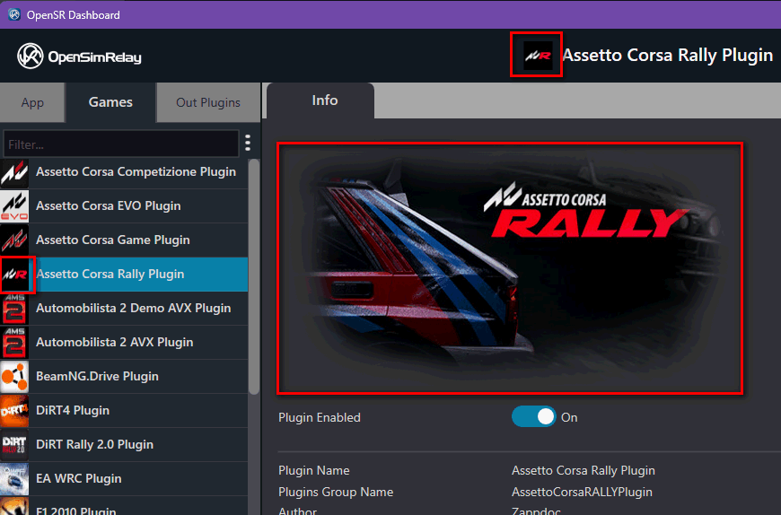
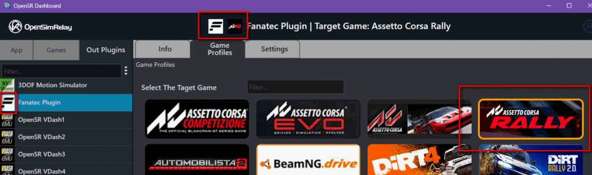

# Plugin Lifecycle Contract

## 1. Overview

All OpenSR plugins (IN and OUT) must implement a **strict lifecycle contract** defined by the core interfaces.

The host relies on this contract for:

- stability
- recovery from failures
- safe start/stop cycles
- plugin validation

Failure to respect this contract can result in:

- automatic retries
- plugin disablement

---

## 2. Lifecycle Functions

### 2.1 Init(…)

**Purpose:**  
Initialize internal state and prepare the plugin for execution. Called when game is detected for IN plugin and soon after the module is loaded successfully for OUT plugin.

### Expected responsibilities:

- Initialize member variables
- Store:
  - `OpenSRContext*`
  - buffer pointers
  - plugin path
- Allocate lightweight resources if needed

### Must NOT:

- Start threads
- Open heavy resources (network, devices, etc.)
- Block execution

### Return value:

- `true` → initialization successful
- `false` → initialization failed

### Failure handling:

- Host will retry `Init()` after a delay
- Delay increases after repeated failures
- Plugin may be **disabled automatically** after too many failures

---

### 2.2 Start()

**Purpose:**  
Start the actual runtime behavior of the plugin.

### Expected responsibilities:

- Load settings (XML or internal)
- Initialize external systems:
  - network (UDP, TCP, etc.)
  - device connections
- Start worker thread(s)

### Must:

- Transition plugin into **running state**

### Return value:

- `true` → started successfully
- `false` → startup failed

### Notes:

- This is where the **main logic begins**
- Most plugins implement their main loop in a worker thread started here

---

### 2.3 Stop()

**Purpose:**  
Gracefully stop runtime activity.

### Expected responsibilities:

- Stop worker thread(s)
- Close:
  - network connections
  - device handles
- Save runtime state if needed

### Must:

- Ensure all threads are properly terminated
- Leave the plugin in a safe, non-running state

### Important:

- Must be **safe and deterministic**
- No background activity should remain after this call

---

### 2.4 Pause() / Resume()

**Purpose:**  
Temporarily suspend and resume plugin activity.

### Expected behavior:

- `Pause()`:
  - Set internal pause flag
  - Suspend processing inside worker loops
- `Resume()`:
  - Clear pause flag
  - Wake suspended threads (e.g., condition variable)

### Requirements:

- Must be **non-destructive**
- Must NOT:
  - destroy resources
  - stop threads

---

### 2.5 Shutdown()

**Purpose:**  
Final cleanup before plugin unload.

### Expected responsibilities:

- Release all remaining resources
- Final cleanup of internal state

### Notes:

- Called after `Stop()`
- Plugin should already be inactive

---

## 3. Lifecycle Behavior Rules

### 3.1 Call Order

Typical sequence:

#### OUT plugins:

```
Load → Init → Start → (Run)
     → Stop → Shutdown → Unload
```

#### IN plugins (per game session):

```
Init → Start → (Run while game is alive)
     → Stop → Shutdown
```

---

### 3.2 Reinitialization

- `Init()` may be called multiple times (after failures)
- Plugins must handle **clean reinitialization**

---

### 3.3 Restart Behavior

- After `Stop()`, the plugin may be:
  - restarted (`Start()` again)
  - or shutdown

Plugins must support:

- clean stop → start cycles

---

### 3.4 Health Monitoring

The host may call:

```
IsRunning()
```

### Requirement:

- Must accurately reflect:
  - thread state
  - runtime health

---

### 3.5 Failure Policy

If a plugin:

- fails `Init()` repeatedly
- fails `Start()`
- behaves incorrectly

The host may:

- retry with backoff
- eventually **disable the plugin**

---

## 4. Threading Contract

All plugins must:

- Create threads in `Start()`
- Stop threads in `Stop()`
- Never leak threads beyond lifecycle boundaries

### Strong requirement:

No thread must survive after `Stop()`

---

## 5. IN Plugin Specific Rules

- Must define:`GetTargetProcessName()`
- Only runs when:
  - target process is detected
- Automatically stopped when:
  - process exits

---

## 6. Mandatory Assets (Plugin Packaging)



Icon and Featured Images



Icons and Thumbnail Images

Each plugin must include:

- `thumbnail.png` (mandatory)
  - Size: **228 × 86**
- `icon.png` (mandatory)
  - Size: **32 × 32**
- `featured.png` (recommended)
  - Range:
    - min: 512 × 280
    - max: 960 × 480

---

## 7. OUT Plugin (Recommended Assets)

For plugins using game profiles:

- `profile_template.xml` (mandatory)
- `preview.jpg` (recommended)

### Purpose of preview:

- Visual representation of the device
- Displayed in profile UI
- Helps user understand configurable elements

---

## 8. Design Philosophy

- `Init()` = lightweight preparation
- `Start()` = real execution begins
- `Stop()` = clean shutdown of runtime
- `Shutdown()` = final cleanup

Everything must be:

- deterministic
- restart-safe
- failure-tolerant
