# Game Profile Template System

## 1. Overview

`profile_template.xml` is the **normalized configuration template** used by OUT plugins that require **per-game user customization**.

Typical use cases:

- hardware devices (LEDs, displays, controllers)
- dashboards / overlays
- telemetry-driven UI systems

---

## 2. Purpose

The template serves **three roles simultaneously**:

### 1. Default configuration

- Acts as the **base profile**
- Used when:
  - creating a new profile
  - initializing autosetup

---

### 2. Schema definition

- Defines:
  - available options
  - data types
  - constraints
- Ensures consistency across all profiles

---

### 3. UI description

- Drives how the dashboard renders the configuration UI:
  - sliders
  - dropdowns
  - text fields
  - images
  - flags, colors, etc.

---

## 3. Ownership & Processing

### Parsed by:

- **Host / Dashboard only**

### Not parsed by:

- Plugins directly (they consume the result)

---

### Host responsibilities:

- Interpret XML
- Generate UI dynamically
- Manage:
  - create / clone / delete profiles
  - autosetup
  - persistence

---

## 4. Template Location

Inside the OUT plugin folder:

```
<OutPlugins>/
  <OutPluginName>/
    profile_template.xml
```

### Default asset root:

- Relative paths are resolved from:
  - the plugin folder

Example:

```
<option name="sli-pro panels" type="image">slipro_panels.png</option>

or better if the image is in an asset folder inside the plugin folder:

<option name="sli-pro panels" type="image">assets/slipro_panels.png</option>
```

---

## 5. XML Structure

### Example for SLI-PRO display device:

```xml
<?xml version="1.0" encoding="utf-8"?>
<settings info="sli-pro device default settings" version="1" type="template">
    <general>
        <gear>
            <option name="reverse" tooltip="Character used for reverse gear" type="char">r</option>
            <option name="neutral" tooltip="Character used for neutral gear" type="char">n</option>
            <option name="max forward gears at startup" tooltip="Maximum number of forward gears detected at startup" type="slider" range="4,8">6</option>
        </gear>
        <option name="general unit" tooltip="Unit system used for telemetry" type="enum" enum="metric,imperial">metric</option>
        <option name="speed unit" tooltip="Select unit used for speed" type="enum" enum="kmh,mph">kmh</option>
        <option name="laptime report delay" tooltip="Delay during lap time is reported" type="slider" range="1,130">8</option>
        <option name="blink delay" tooltip="Default blink delay (ms)" type="slider" range="16,1000">600</option>
    </general>
    <display>
        <option name="sli-pro panels" type="image">slipro_panels.png</option>
        <option name="left display function" tooltip="List of data shown on left display (first one is the default)" type="enum_list" enum="none,speed,lap,position,fuel,sector,gear,rpm,current lap time,last lap time,best lap time,gap vs leader,gap vs next,gap vs behind,delta time vs best,delta time vs last,laps remaining,brake bias,total laps,system date,system time,fuel:speed,position:speed,lap:speed,sector:speed,lap:total laps">speed</option>
        <option name="right display function" tooltip="List of data shown on right display (first one is the default)" type="enum_list" enum="none,speed,lap,position,fuel,sector,gear,rpm,current lap time,last lap time,best lap time,gap vs leader,gap vs next,gap vs behind,delta time vs best,delta time vs last,laps remaining,brake bias,total laps,system date,system time,fuel:speed,position:speed,lap:speed,sector:speed,lap:total laps">current lap time</option>
        <option name="quick info left function" tooltip="Data shown on left display when quick info button is triggered" type="enum" enum="none,speed,lap,position,fuel,sector,gear,rpm,current lap time,last lap time,best lap time,gap vs leader,gap vs next,gap vs behind,delta time vs best,delta time vs last,laps remaining,brake bias,total laps,system date,system time,fuel:speed,position:speed,lap:speed,sector:speed,lap:total laps">position</option>
        <option name="quick info right function" tooltip="Data shown on right display when quick info button is triggered" type="enum" enum="none,speed,lap,position,fuel,sector,gear,rpm,current lap time,last lap time,best lap time,gap vs leader,gap vs next,gap vs behind,delta time vs best,delta time vs last,laps remaining,brake bias,total laps,system date,system time,fuel:speed,position:speed,lap:speed,sector:speed,lap:total laps">fuel</option>
        <controls>
            <slipro>
                <option signature="" device="" name="sw up-down left display" tooltip="Input to change left display pages" type="input"></option>
                <option signature="" device="" name="sw up-down right display" tooltip="Input to change right display pages" type="input"></option>
                <option signature="0" device="0" name="btn quick information" tooltip="Input to show quick information" type="input">0</option>
            </slipro>
        </controls>
    </display>
    <shiftlights>
        <option name="shift-lights function allowed" tooltip="Enable shift-lights feature" type="bool">true</option>
        <option name="shift-lights method" tooltip="Select shift-lights animation method" type="enum" enum="Progressive,Alternate,Percentage,Absolute,Side To Center,F1 Semi Progressive,F1 KERS+Alternate,F1 Reverse KERS+Alternate">Percentage</option>
        <option name="rpm threshold percentage" tooltip="RPM percentage thresholds for each LED" type="rpm_curve">55,60,64,68,74,75,80,85,90,95,97,98,99</option>
        <option name="rpm threshold absolute" tooltip="Absolute RPM thresholds for each LED" type="rpm_curve_abs">5452,5545,5823,6354,6410,6675,7252,7545,7823,8354,8510,8655,8675</option>
        <option name="blank shift-lights with last gear" tooltip="Disable shift-lights in highest gear" type="bool">false</option>
    </shiftlights>
    <pitlimiter>
        <option name="pit-limiter function allowed" tooltip="Enable pit limiter feedback" type="bool">true</option>
        <option name="pit-limiter active state" tooltip="LED pattern when pit limiter blink state is on" type="rpm_led" colors="GGGGRRRRRBBBB">5461</option>
        <option name="pit-limiter alternate state" tooltip="LED pattern when pit limiter blink state is off" type="rpm_led" colors="GGGGRRRRRBBBB">2730</option>
        <option name="pit-limiter on rpm led only" tooltip="Use only RPM LED for pit limiter feedback" type="bool">false</option>
        <option name="pit-limiter blink delay" tooltip="Blink delay for pit limiter feedback (ms)" type="slider" range="16,1000">600</option>
    </pitlimiter>
    <shiftpoints>
        <option name="optimal shift-points function allowed" tooltip="Enable optimal shift-points (OSP) feedback" type="bool">true</option>
        <option name="optimal shift-points method" tooltip="Select optimal shift-points behavior method" type="enum" enum="Default,Default and Last RPM blinking,Default Blinking and Last RPM Not Blinking,Last RPM Alone Blinking,Last RPM Alone Not Blinking">default</option>
        <option name="optimal shift-points factor" tooltip="Optimal shift-points factor (low value: demanding, high value: safe)" type="slider" range="10,250">128</option>
        <option name="optimal shift-points factors match gear ratio allowed" tooltip="Adjust shift-points factors automatically to gear ratios (see below)" type="bool">false</option>
        <option name="optimal shift-points factors values" tooltip="Per gear optimal shift factors" type="osp_gear_list">1.8,1.5,1.1,1.0,1.0,1.0,1.0,1.0,1.0</option>
        <option name="optimal shift-points on first gear allowed" tooltip="Enable optimal shift-points feedback in first gear" type="bool">false</option>
        <option name="optimal shift-points blink delay" tooltip="Blink delay for optimal shift-points feedback (ms)" type="slider" range="10,200">50</option>
        <controls>
            <slipro>
                <option signature="0" device="0" name="btn up osp factor" tooltip="Input to increase optimal shift-points factor" type="input">0</option>
                <option signature="0" device="0" name="btn down osp factor" tooltip="Input to decrease optimal shift-points factor" type="input">0</option>
            </slipro>
        </controls>
    </shiftpoints>
    <brightness>
        <option name="global brightness" tooltip="Set overall device brightness level" type="slider" range="1,254">200</option>
        <option name="brightness step value" tooltip="Brightness adjustment step value (used by input)" type="number">10</option>
        <option name="display brightness state" tooltip="Enable or disable display brightness control" type="bool">true</option>
        <controls>
            <slipro>
                <option signature="0" device="0" name="btn up brightness" tooltip="Input to increase brightness" type="input">0</option>
                <option signature="0" device="0" name="btn down brightness" tooltip="Input to decrease brightness" type="input">0</option>
            </slipro>
        </controls>
    </brightness>
    <led info="leds layout" num_external="5">
        <option name="led abs" tooltip="Assign LED for ABS status" type="flag_external_led">2048</option>
        <option name="led traction control" tooltip="Assign LED for traction control status" type="flag_external_led">4096</option>
        <option name="led damage" tooltip="Assign LED for vehicle damage status" type="flag_external_led">4</option>
        <option name="led drs legal" tooltip="Assign LED for DRS availability" type="flag_external_led">0</option>
        <option name="led drs" tooltip="Assign LED for DRS active state" type="flag_external_led">512</option>
        <option name="led headlights" tooltip="Assign LED for headlights status" type="flag_external_led">0</option>
        <option name="led kers" tooltip="Assign LED for KERS status" type="flag_external_led">0</option>
        <option name="led lowfuel" tooltip="Assign LED for low fuel warning" type="flag_external_led">8</option>
        <option name="led optimal shift-points" tooltip="Assign LED for optimal shift-points feedback" type="flag_external_led">33</option>
        <option name="led overheating" tooltip="Assign LED for engine overheating" type="flag_external_led">1028</option>
        <option name="led pit request" tooltip="Assign LED for pit request status" type="flag_external_led">0</option>
        <option name="led pit-limiter" tooltip="Assign LED for pit limiter status" type="flag_external_led">2048</option>
        <option name="led power" tooltip="Assign LED for power status" type="flag_external_led">256</option>
        <option name="led rev limit" tooltip="Assign LED for rev limiter status" type="flag_external_led">0</option>
        <option name="led start lights" tooltip="Assign LED for race start lights" type="flag_external_led">0</option>
        <option name="led green flag" tooltip="Assign LED for green flag state" type="flag_external_led">0</option>
        <option name="led blue flag" tooltip="Assign LED for blue flag state" type="flag_external_led">1</option>
        <option name="led yellow flag" tooltip="Assign LED for yellow flag state" type="flag_external_led">2050</option>
        <option name="led full yellow flag" tooltip="Assign LED for full course yellow state" type="flag_external_led">18</option>
        <option name="led black flag" tooltip="Assign LED for black flag state" type="flag_external_led">0</option>
    </led>
</settings>
```

### Example For 3DOF Motion Simulator:

```xml
<?xml version="1.0" encoding="utf-8"?>
<settings info="3DOF Motion Simulator default settings" version="1" type="template">
    <!-- FILTERS GLOBAL -->
    <option name="smoothing factor" id="filter-smooth-factor" tooltip="Global smoothing factor for all motion signals (0 = none, 1 = max)" type="slider" range="0.0,1.0">0.20000000298023224</option>
    <option name="separator" id="separator" type="separator"/>
    <!-- PITCH -->
    <option name="gain pitch" id="gain-pitch" tooltip="Amplitude gain for pitch motion" type="slider" range="0.0,500.0">138.00</option>
    <option name="pitch in use" id="in-use-pitch" tooltip="Enable pitch motion" type="bool">true</option>
    <option name="pitch inverted" id="invert-pitch" tooltip="Invert pitch motion direction" type="bool">false</option>
    <option name="pitch smooth" id="smooth-pitch" tooltip="Apply smoothing filter to pitch motion" type="bool">false</option>
    <option name="separator" id="separator" type="separator"/>
    <!-- ROLL -->
    <option name="gain roll" id="gain-roll" tooltip="Amplitude gain for roll motion" type="slider" range="0.0,500.0">138.00</option>
    <option name="roll in use" id="in-use-roll" tooltip="Enable roll motion" type="bool">true</option>
    <option name="roll inverted" id="invert-roll" tooltip="Invert roll motion direction" type="bool">false</option>
    <option name="roll smooth" id="smooth-roll" tooltip="Apply smoothing filter to roll motion" type="bool">false</option>
    <option name="separator" id="separator" type="separator"/>
    <!-- ACCEL Z (SURGE) -->
    <option name="gain surge" id="gain-accelz" tooltip="Amplitude gain for surge (forward/backward) motion" type="slider" range="0.0,50.0">3.50</option>
    <option name="surge in use" id="in-use-accelz" tooltip="Enable surge motion" type="bool">true</option>
    <option name="surge inverted" id="invert-accelz" tooltip="Invert surge motion direction" type="bool">false</option>
    <option name="surge smooth" id="smooth-accelz" tooltip="Apply smoothing filter to surge motion" type="bool">true</option>
    <option name="separator" id="separator" type="separator"/>
    <!-- ACCEL X (SWAY) -->
    <option name="gain sway" id="gain-accelx" tooltip="Amplitude gain for sway (left/right) motion" type="slider" range="0.0,50.0">2.70</option>
    <option name="sway in use" id="in-use-accelx" tooltip="Enable sway motion" type="bool">true</option>
    <option name="sway inverted" id="invert-accelx" tooltip="Invert sway motion direction" type="bool">false</option>
    <option name="sway smooth" id="smooth-accelx" tooltip="Apply smoothing filter to sway motion" type="bool">true</option>
    <option name="separator" id="separator" type="separator"/>
    <!-- ACCEL Y (HEAVE) -->
    <option name="gain heave" id="gain-accely" tooltip="Amplitude gain for heave (up/down) motion" type="slider" range="0.0,50.0">4.21</option>
    <option name="heave in use" id="in-use-accely" tooltip="Enable heave motion" type="bool">true</option>
    <option name="heave inverted" id="invert-accely" tooltip="Invert heave motion direction" type="bool">false</option>
    <option name="heave smooth" id="smooth-accely" tooltip="Apply smoothing filter to heave motion (usually false for texture)" type="bool">false</option>
    <option name="separator" id="separator" type="separator">Traction Loss Configuration</option>
    <!-- YAW RATE -->
    <option name="gain yaw rate" id="gain-yaw-rate" tooltip="Amplitude gain for yaw rate motion" type="slider" range="0.0,100.0">5</option>
    <option name="yaw rate in use" id="in-use-yaw-rate" tooltip="Enable yaw rate motion" type="bool">false</option>
    <option name="yaw rate inverted" id="invert-yaw-rate" tooltip="Invert yaw rate motion direction" type="bool">false</option>
    <option name="yaw rate smooth" id="smooth-yaw-rate" tooltip="Apply smoothing filter to yaw rate motion" type="bool">false</option>
    <option name="separator" id="separator" type="separator"/>
    <!-- PITCH RATE -->
    <option name="gain pitch rate" id="gain-pitch-rate" tooltip="Amplitude gain for pitch rate motion" type="slider" range="0.0,100.0">5</option>
    <option name="pitch rate in use" id="in-use-pitch-rate" tooltip="Enable pitch rate motion" type="bool">false</option>
    <option name="pitch rate inverted" id="invert-pitch-rate" tooltip="Invert pitch rate motion direction" type="bool">false</option>
    <option name="pitch rate smooth" id="smooth-pitch-rate" tooltip="Apply smoothing filter to pitch rate motion" type="bool">false</option>
    <option name="separator" id="separator" type="separator"/>
    <!-- ROLL RATE -->
    <option name="gain roll rate" id="gain-roll-rate" tooltip="Amplitude gain for roll rate motion" type="slider" range="0.0,100.0">5</option>
    <option name="roll rate in use" id="in-use-roll-rate" tooltip="Enable roll rate motion" type="bool">false</option>
    <option name="roll rate inverted" id="invert-roll-rate" tooltip="Invert roll rate motion direction" type="bool">false</option>
    <option name="roll rate smooth" id="smooth-roll-rate" tooltip="Apply smoothing filter to roll rate motion" type="bool">false</option>
</settings>
```

---

## 6. Supported Concepts

### Options

Each `<option>` defines:

- name (identifier)
- type (UI + data type)
- attributes:
  - `tooltip` (optional)
  - slider / `range`
  - `enum`
  - etc.
- default value

---

### UI-driven types (examples)

[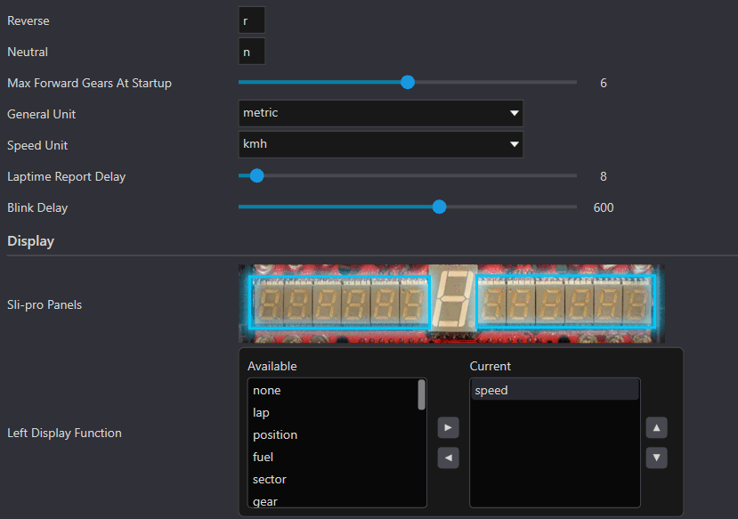](assets/xml_ui.png)

- `type="char"`
- `type="numbe`r”
- `type="slider" range="1,254"`
- `type="enum" enum="metric,imperial"`
- `type="image"`
- `type="bool"`
- `type="image"`
- `type="enum_list" enum="none,speed,lap,position,fuel"`
- `type="rpm_curve"` (percentage value)
- `type="rpm_curve_abs"` (absolute rpm value)
- `type="rpm_led" colors="GGGGRRRRRBBBB"`
- `type="osp_gear_list"`
- `type="flag_external_led"` (bitmask)
- and others, check the *profile_template.xml* provided in OutPlugins folder for more info

---

### Hierarchy

- Nested groups are allowed, examples:

```xml
<general> </general>
<display> </display>
<shiftlights> </shiftlights>
<pitlimiter> </pitlimiter>
<shiftpoints> </shiftpoints>
<brightness> </brightness>
<led num_external="5"> </led>
```

This structure directly maps to UI layout.

---

## 7. Profile Lifecycle

Managed entirely by the host:

### User actions:

- Create
- Clone
- Modify
- Save
- Delete
- Set as autosetup
- Load (make it active for current game)

---

### Automatic behavior:

- Autosetup profile loaded when:
  - game is detected and IN game plugin loaded

---

## 8. Plugin Interaction (Critical)

Plugins do **not directly manage profile files**.

Instead, they react to changes via:

```
OnContextChanged(OpenSRContextChange reason)

GameProfileHelper class is a standalone helper class used to parse OpenSR game profile XML files (included with the SDK).
```

---

## 9. Change Notification System (callback)

### Triggered when:

- Profile changes: *`osr::OpenSRContextChange::ProfilePathChanged`*
- Settings change: *`osr::OpenSRContextChange::SettingsChanged`*
- Device check requested: *`osr::OpenSRContextChange::CheckDevice`*

---

### Example:

```cpp
void MyDeviceOutPlugin::OnContextChanged(osr::OpenSRContextChange reason) {
    if (m_pContext && reason == osr::OpenSRContextChange::ProfilePathChanged) {
        std::wstring profilePath = m_pContext->currentProfilePath;
        if (!profilePath.empty()) {
             LoadConfiguration(profilePath);
        }
    }
    else if (m_pContext && reason == osr::OpenSRContextChange::SettingsChanged) {
        if (!m_pluginPath.empty()) {
            std::wstring settingsPath = StringUtils::createWString(m_pContext->osrDocFolder, L"\\", m_pluginPath, "\\settings.xml");
            if (!LoadPluginSettings(settingsPath, m_pluginSettings)) {
                // ...
            }

        }
    }
    else if (reason == osr::OpenSRContextChange::CheckDevice) {
        CheckDevice();
    }
}
```

---

## 10. Plugin Responsibilities

On notification:

### For Profile:

- Reload xml configuration from:
  - `currentProfilePath`

### For settings:

- Reload from:
  - `settings.xml` in plugin folder

### For Checking Device:

- run a function to check the device managed by the plugin

---

## 11. Versioning

### Rule:

```
version="1"
```

- All future changes are:
  - **backward compatible**
- No strict version migration required

---

## 12. Separation of Concerns

### Profiles (`profile_template.xml`)

- Game-specific behavior
- Device mapping / telemetry usage

### Settings (`settings.xml` or `settings.dll`)

- General plugin configuration

---

### Key point:

They are:

- **independent systems**
- only linked via:
  - the same notification callback

---

## 13. Developer Experience Features

- Dashboard provides:
  - full UI generation
  - asset rendering
  - profile management
- Shortcut:
  - `CTRL + Click` on plugin opens plugin folder

---

## 14. Design Philosophy

- XML defines:
  - structure
  - behavior
  - UI
- Host handles:
  - complexity
  - persistence
  - UX
- Plugin focuses on:
  - execution logic
  - reacting to notifications

# 15. Loading & Parsing the Profile in Your Plugin

The host owns the profile files (create / clone / save / switch). Your plugin only **reads** the active profile:

- once at startup, in `init()`
- again when the user switches profile, via `OnContextChanged(ProfilePathChanged)` (see section 9)

### Start with an existing template

The fastest way to create a `profile_template.xml` for your device: **copy an existing one** (Arduino, SLI-PRO, Fanatec, 3DOF — all in `OutPlugins`) and edit it. Those four templates demonstrate most of the types documented in section 16 below.

### Call flow

```cpp
// init(): load the active profile once at startup
void CMyDevicePlugin::Init()
{
    // ...
    if (m_pContext && !m_pContext->currentProfilePath.empty())
    {
        if (!LoadGameProfile(m_pContext->currentProfilePath))
            std::wcerr << L"[MyPlugin] Loading profile failed (using default values)" << std::endl;
    }
}

// OnContextChanged(): reload when the profile changes
void CMyDevicePlugin::OnContextChanged(osr::OpenSRContextChange reason)
{
    if (m_pContext && reason == osr::OpenSRContextChange::ProfilePathChanged)
    {
        std::wstring profilePath = m_pContext->currentProfilePath;
        std::wcout << L"[MyPlugin] Profile needs to be reloaded: " << profilePath << std::endl;

        if (!LoadGameProfile(profilePath))
            std::wcerr << L"[MyPlugin] Loading profile failed (using default values)" << std::endl;
    }
}
```

### `LoadGameProfile()` — generic walk

Walk every section of `<settings>`, then every `<option>` inside it, and dispatch on `type`. This is the same pattern used by the SDK helper class `GameProfileHelper` (provided with the SDK). If you only need the standard sections (`general`, `display`, `shiftlights`, `pitlimiter`, `shiftpoints`, `brightness`, `led`), you can call `GameProfileHelper::LoadProfile(profilePath)` directly and read its parsed config + `inputMappings` instead.

```cpp
bool CMyDevicePlugin::LoadGameProfile(const std::wstring& profilePath)
{
    tinyxml2::XMLDocument doc;

    // Wide path -> narrow (or open with _wfsopen for non-ASCII paths)
    std::string path(profilePath.begin(), profilePath.end);

    if (doc.LoadFile(path.c_str()) != tinyxml2::XML_SUCCESS)
        return false;

    tinyxml2::XMLElement* root = doc.FirstChildElement("settings");
    if (!root)
        return false;

    // Every non-option child of <settings> is a section (UI group header).
    // Options may also sit directly under <settings> (3DOF template)
    // or in nested sub-sections (e.g. <gear> inside <general>) -> recurse if needed.
    for (tinyxml2::XMLElement* section = root->FirstChildElement();
         section;
         section = section->NextSiblingElement())
    {
        for (tinyxml2::XMLElement* opt = section->FirstChildElement("option");
             opt;
             opt = opt->NextSiblingElement("option"))
        {
            const char* name = opt->Attribute("name");
            const char* type = opt->Attribute("type");
            const char* text = opt->GetText();

            if (!name || !type)
                continue;

            if (strcmp(type, "bool") == 0)
                m_cfg.someFlag = opt->BoolText(true);
            else if (strcmp(type, "char") == 0 && text)
                m_cfg.someChar = text[0];
            else if (strcmp(type, "text") == 0 && text)
                m_cfg.someText = text;
            else if (strcmp(type, "number") == 0)
                m_cfg.someInt = opt->IntText(0);
            else if (strcmp(type, "float") == 0)
                m_cfg.someFloat = opt->FloatText(0.0f);
            else if (strcmp(type, "ip") == 0 && text)
                m_cfg.someIp = text;
            else if (strcmp(type, "password") == 0 && text)
                m_cfg.someSecret = text;
            else if (strcmp(type, "slider") == 0)
                m_cfg.someValue = opt->IntText(0);            // FloatText() for float ranges
            else if (strcmp(type, "enum") == 0 && text)
                m_cfg.someMethod = (strcmp(text, "imperial") == 0);
            else if (strcmp(type, "enum_list") == 0 && text)
                m_cfg.displayFunc = text;                     // e.g. "speed,lap,fuel"
            else if (strcmp(type, "list") == 0 && text)
                // split text on ',' (see type="list" in section 16)
            else if (strcmp(type, "rating") == 0)
                m_cfg.rating = opt->FloatText(0.0f);
            else if (strcmp(type, "rpm_curve") == 0)
                m_cfg.rpmPct = GameProfileHelper::ParseCsvFloat(text);
            else if (strcmp(type, "rpm_curve_abs") == 0)
                m_cfg.rpmAbs = GameProfileHelper::ParseCsvInt(text);
            else if (strcmp(type, "gear_curve_abs") == 0)
                m_cfg.gearRpm = GameProfileHelper::ParseCsvInt(text);
            else if (strcmp(type, "osp_gear_list") == 0)
                m_cfg.ospFactors = GameProfileHelper::ParseCsvFloat(text);
            else if (strcmp(type, "rpm_led") == 0 && text)
                m_cfg.ledState = std::stoi(text);
            else if (strcmp(type, "flag_external_led") == 0)
                m_cfg.ledMasks[name] = opt->IntText(0);
            else if (strcmp(type, "led") == 0)
                m_cfg.ledStates[opt->IntAttribute("index")] = opt->BoolText(false);
            else if (strcmp(type, "rgba_led") == 0 && text)
                m_cfg.ledColors[opt->IntAttribute("index")] =
                    GameProfileHelper::ParseHexColor(text);
            else if (strcmp(type, "fanatec_rgb_led") == 0 && text)
                m_cfg.ledColors[opt->IntAttribute("index")] =
                    GameProfileHelper::ParseHexColor(text);
            else if (strcmp(type, "input") == 0)
                ParseInputOption(opt);                        // see type="input" in section 16
            // "image" / "separator" / "static" / "link" / unknown types: UI-only -> ignore
        }
    }
    return true;
}
```

---

## 16. Type Reference

All types available in a game profile. One block per type: **options** / **UI** / **XML** / **Parse**. **Value types:** `bool` · `char` · `text` · `number` · `float` · `ip` · `password` · `slider` · `enum` · `enum_list` · `list` · `rating` **Curves & per-LED / per-gear lists:** `rpm_curve` · `rpm_curve_abs` · `gear_curve_abs` · `osp_gear_list` **LED patterns & colors:** `rpm_led` · `flag_external_led` · `led` · `rgba_led` · `fanatec_rgb_led` **Input binding:** `input` **UI-only types:** `image` · `separator` · `static` · `link`

---

### `bool` — on/off toggle

- **Value:** `true` / `false`

**UI:**

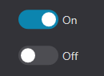

**XML:**

```xml
<option name="shift-lights function allowed" tooltip="Enable shift-lights feature" type="bool">true</option>
```

**Parse:**

```cpp
m_config.shiftLights.allowed = opt->BoolText(true);   // argument = default when no text
```

---

### `char` — single character

Used for display characters (gear `r` / `n`, OSP bracket characters, …).

**UI:**

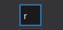

**XML:**

```xml
<option name="reverse" tooltip="Character used for reverse gear" type="char">r</option>
```

**Parse:**

```cpp
m_config.general.reverseChar = opt->GetText()[0];
```

---

### `text` — text field

Free text input.

**UI:**


**XML:**

```xml
<option name="custom label" tooltip="Custom text shown on the device" type="text">Hello</option>
```

**Parse:**

```cpp
std::string s = opt->GetText();   // free text
```

---

### `number` — integer field

Free integer input. Optional `range="min,max"` clamps the value in the UI.

**UI:**


**XML:**

```xml
<option name="brightness step value" tooltip="Brightness adjustment step value (used by input)" type="number">10</option>
```

**Parse:**

```cpp
m_config.brightnessStep = opt->IntText(10);
```

---

### `float` — float field

Free float input (text field with decimal filter).

**UI:**


**XML:**

```xml
<option name="gain" tooltip="Amplitude gain" type="float">1.5</option>
```

**Parse:**

```cpp
m_config.gain = opt->FloatText(1.5f);
```

---

### `ip` — IP address field

Text field restricted to a valid IPv4 address (derived from `text`).

**UI:**

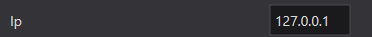

**XML:**

```xml
<option name="server ip" tooltip="IP address of the telemetry server" type="ip">127.0.0.1</option>
```

**Parse:**

```cpp
std::string ip = opt->GetText();   // "192.168.1.10"
```

---

### `password` — hidden text field

Text field shown as dots in the UI (derived from `text`).

**UI:**

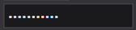

**XML:**

```xml
<option name="api key" tooltip="Secret key (hidden in UI)" type="password">my-secret-key</option>
```

**Parse:**

```cpp
std::string secret = opt->GetText();
```

---

### `slider` — ranged slider

- **Attribute:** `range="min,max"` — integer or **float** range. A `.` inside `range` means float (host decides).

**UI:**


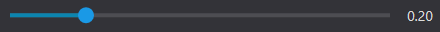

**XML:**

```xml
<option name="blink delay" tooltip="Default blink delay (ms)" type="slider" range="16,1000">600</option>
<option name="smoothing factor" id="filter-smooth-factor" tooltip="Global smoothing factor (0 = none, 1 = max)" type="slider" range="0.0,1.0">0.2</option>
```

**Parse:**

```cpp
const char* range = opt->Attribute("range");              // "16,1000" or "0.0,1.0"
bool isFloat = (range && strchr(range, '.') != nullptr);

if (isFloat)
    m_config.smoothFactor = opt->FloatText(0.2f);         // float range
else
    m_config.blinkDelay   = opt->IntText(600);            // int range
```

---

### `enum` — dropdown

- **Attribute:** `enum="opt1,opt2,..."` — the list of choices.
- **Value:** the currently selected choice.

**UI:**

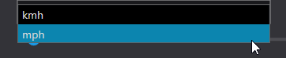

**XML:**

```xml
<option name="speed unit" tooltip="Select unit used for speed" type="enum" enum="kmh,mph">kmh</option>
```

**Parse:**

```cpp
// available choices: split opt->Attribute("enum") on ','
const char* val = opt->GetText();                         // selected choice
m_config.general.speedUnitMetric = !(val && strcmp(val, "mph") == 0);
```

---

### `enum_list` — multi-select list

- **Attribute:** `enum="item1,item2,..."` — all available items.
- **Value:** the selected items, comma separated, **in order** (first one is the default).

**UI:**

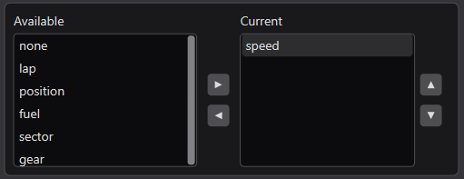

**XML:**

```xml
<option name="display function" tooltip="List of data shown on main display (first one is the default)"
        type="enum_list" enum="none,speed,lap,position,fuel,sector,gear">speed</option>
```

**Parse:**

```cpp
m_config.display.mainFunc = opt->GetText();               // keep raw list, e.g. "speed,lap,fuel"

// resolve one item of the list (position of the switch, -1 = first item):
int idx = GameProfileHelper::GetDisplayFuncIndex(opt->GetText(), swIndex);
```

---

### `list` — editable list

Comma-separated list of items, editable in the UI (list box).

**UI:**

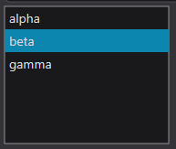

**XML:**

```xml
<option name="custom items" tooltip="Comma-separated list of items" type="list">alpha,beta,gamma</option>
```

**Parse:**

```cpp
std::vector<std::string> items;
std::stringstream ss(opt->GetText());
std::string item;
while (std::getline(ss, item, ','))
    items.push_back(GameProfileHelper::Trim(item));
```

---

### `rating` — star rating (0–5)

Star rating control; value stored as a float between 0 and 5 (used e.g. to rate plugins).

**UI:**


**XML:**

```xml
<option name="rating" tooltip="Rate this plugin" type="rating">4.5</option>
```

**Parse:**

```cpp
float rating = opt->FloatText(0.0f);
if (rating < 0.0f || rating > 5.0f) rating = 0.0f;
```

---

### `rpm_curve` — RPM percentage thresholds

Comma-separated **percentage** values, one per shift-light LED.

**UI:**

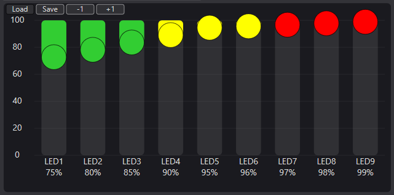

**XML:**

```xml
<option name="rpm threshold percentage" tooltip="RPM percentage thresholds for each LED"
        type="rpm_curve">75,80,85,90,95,96,97,98,99</option>
```

**Parse:**

```cpp
m_config.shiftLights.rpmThresholdsPct = GameProfileHelper::ParseCsvFloat(opt->GetText());
```

---

### `rpm_curve_abs` — absolute RPM thresholds

Comma-separated **absolute** RPM values, one per shift-light LED.

**UI:**

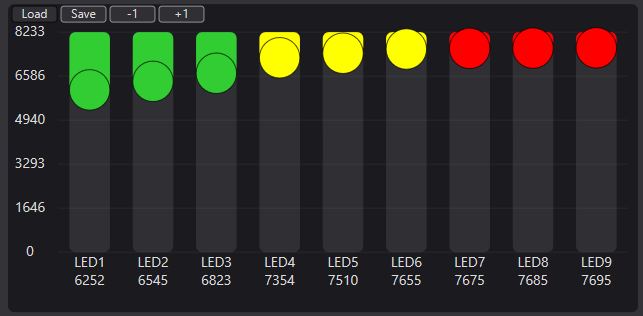

**XML:**

```xml
<option name="rpm threshold absolute" tooltip="Absolute RPM thresholds for each LED"
        type="rpm_curve_abs">6252,6545,6823,7354,7510,7655,7675,7685,7695</option>
```

**Parse:**

```cpp
m_config.shiftLights.rpmThresholdsAbs = GameProfileHelper::ParseCsvInt(opt->GetText());
```

---

### `gear_curve_abs` — RPM threshold per gear

Comma-separated absolute RPM shift-point threshold **per gear** (`0` = gear not used).

**UI:**

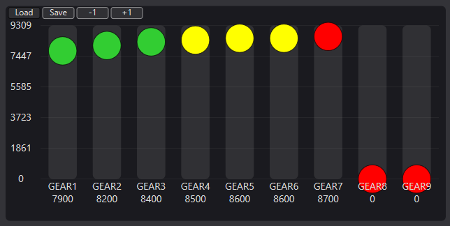

**XML:**

```xml
<option name="optimal shift-points rpm thresholds" tooltip="Set custom shift-point RPM thresholds for each gear"
        type="gear_curve_abs">7900,8200,8400,8500,8600,8600,8700,0,0</option>
```

**Parse:**

```cpp
m_config.shiftPoints.rpmThresholdsPerGear = GameProfileHelper::ParseCsvInt(opt->GetText());
```

---

### `osp_gear_list` — factor per gear

Comma-separated float factors, **per gear** (up to 9).

**UI:**

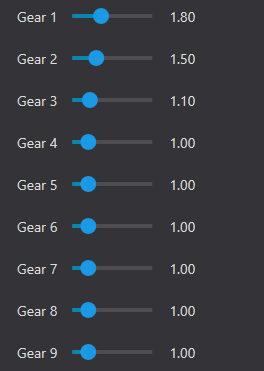

**XML:**

```xml
<option name="optimal shift-points factors values" tooltip="Per gear optimal shift factors"
        type="osp_gear_list">1.8,1.5,1.1,1.0,1.0,1.0,1.0,1.0,1.0</option>
```

**Parse:**

```cpp
m_config.shiftPoints.factorsPerGear = GameProfileHelper::ParseCsvFloat(opt->GetText());
```

---

### `rpm_led` — LED strip pattern (bitmask)

- **Value:** bitmask of the RPM LED strip.
- **Attribute:** `colors="..."` — color of each LED position, one letter per LED (`G` `R` `B` `Y` `O` `C` `M` `W`).

**UI:**


**XML:**

```xml
<option name="pit-limiter active state" tooltip="LED pattern when pit limiter blink state is on"
        type="rpm_led" colors="GGGGRRRRRBBBB">5461</option>
```

**Parse:**

```cpp
int state = std::stoi(opt->GetText());                    // bitmask of the strip
if (state > 0)
    m_config.pitLimiter.method = state;

const char* colors = opt->Attribute("colors");            // e.g. "GGGGRRRRRBBBB" — one char per LED
```

---

### `flag_external_led` — status → LED assignment (bitmask)

- **Value:** bitmask: flag LEDs first, then external LEDs.
- **The LED strip layout comes from the parent**`<led>`**element**, not from the option:
  - `colors` — flag LED colors (some templates write `flag_colors`)
  - `num_external` — number of external LEDs
  - `external_colors` — their colors

**UI:**


**XML:**

```xml
<led info="leds layout" flag_colors="BYRRYB" num_external="5" external_colors="RRYYG">
    <option name="led abs" tooltip="Assign LED for ABS status" type="flag_external_led">256</option>
    <option name="led blue flag" tooltip="Assign LED for blue flag state" type="flag_external_led">1</option>
</led>
```

**Parse:**

```cpp
// per option: store the mask per status name
m_config.led.flagExternalEventMasks[name] = opt->IntText(0);

// parent <led> attributes describe the strip (used by the host UI):
const tinyxml2::XMLElement* led = opt->Parent()->ToElement();
const char* flagColors = led->Attribute("colors");        // e.g. "RYBRYB"
int         numExt     = led->IntAttribute("num_external", 0);
const char* extColors  = led->Attribute("external_colors");
```

---

### `led` — single LED state

A single on/off LED.

- **Attributes:**
  - `index` — LED position
  - `color` — LED color (`RRGGBBAA` hex)
- **Value:** `true` / `false` (on/off)

**UI:**


**XML:**

```xml
<option name="led 0" index="0" color="FF0000FF" type="led">true</option>
```

**Parse:**

```cpp
int  idx   = opt->IntAttribute("index");
bool on    = opt->BoolText(false);
const char* color = opt->Attribute("color");              // "RRGGBBAA"
m_config.led.states[idx] = on;
```

---

### `rgba_led` — RGB color picker

- **Value:** color in `RRGGBBAA` hex.
- **Attribute:** `index` — which LED this color belongs to.

**UI:**

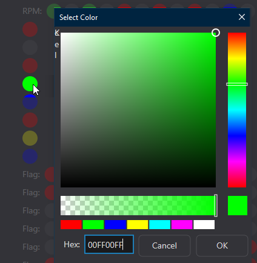

**XML:**

```xml
<option name="rgb led 1" index="1" type="rgba_led">FF0000FF</option>
```

**Parse:** (as done by `GameProfileHelper::ParseLedSection`)

```cpp
int idx = opt->IntAttribute("index");
m_config.led.colors[idx] = GameProfileHelper::ParseHexColor(opt->GetText());   // 0x00RRGGBB
```

---

### `fanatec_rgb_led` — RGB color picker (Fanatec)

- **Value:** color in `RRGGBBAA` hex.
- **Attribute:** `index` — which LED this color belongs to.

**UI:**

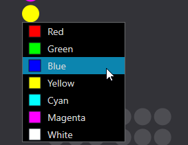

**XML:**

```xml
<option name="flag led 1" index="1" tooltip="Color for first flag LED" type="fanatec_rgb_led">FF0000FF</option>
```

**Parse:**

```cpp
int idx = opt->IntAttribute("index");
m_config.led.colors[idx] = GameProfileHelper::ParseHexColor(opt->GetText());   // 0x00RRGGBB
```

`ParseHexColor` reads `RRGGBBAA` and strips the alpha byte → `0x00RRGGBB` (RGB, as used internally by OpenSR LED systems). Note: `GameProfileHelper::ParseLedSection` currently keys on `type="rgba_led"` — for `fanatec_rgb_led` replicate the same two lines (or extend the helper’s comparison).

---

### `input` — hardware input binding

- **Location:** inside `<controls>` → one child element **per device** (e.g. `<arduino>`, `<slipro>`, `<fanatec>`).
- **Attributes:**
  - `signature` — device signature
  - `device` — device name
  - `info` — human-readable input description (filled by the host UI)
- **Value:** input code — `B<n>` button, `S<n>` axis/switch, `H<n>` hat. Empty or `0` = unassigned (default in templates).

**UI:**


**XML:**

```xml
<controls>
    <slipro>
        <option signature="0" device="0" name="btn quick information"
                tooltip="Input to show quick information" type="input">0</option>
        <option signature="" device="" name="sw up-down left display"
                tooltip="Input to change left display pages" type="input"></option>
    </slipro>
</controls>
```

**Parse** (as done by `GameProfileHelper::ParseControlsInputs`):

```cpp
tinyxml2::XMLElement* controls = section->FirstChildElement("controls");
if (controls)
for (tinyxml2::XMLElement* dev = controls->FirstChildElement();
     dev; dev = dev->NextSiblingElement())
{
    for (tinyxml2::XMLElement* opt = dev->FirstChildElement("option");
         opt; opt = opt->NextSiblingElement("option"))
    {
        const char* type = opt->Attribute("type");
        if (!type || strcmp(type, "input") != 0) continue;

        const char* sig  = opt->Attribute("signature");
        const char* name = opt->Attribute("name");
        const char* text = opt->GetText();                // "B11", "S2", "H4" or ""

        if (!sig || !name || !text || strlen(text) < 2) continue;   // unassigned

        int devIndex = std::stoi(text + 1);

        if      (text[0] == 'B') inputMappings[sig][devIndex]       = name; // button
        else if (text[0] == 'S') inputMappings[sig][devIndex + 1000] = name; // axis / switch
        else if (text[0] == 'H') inputMappings[sig][devIndex + 2000] = name; // hat
    }
}
```

---

### `image` — *(UI-only)*

Displays an image from the **plugin folder**; value = file name or **relative path** (e.g. `assets/my_img.png`). Not consumed by the plugin.

**UI:**

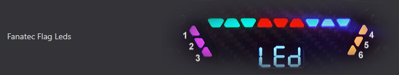

**XML:**

```xml
<option name="sli-pro panels" type="image">slipro_panels.png</option>
<option name="GT Style" type="image">assets\fanatec_rpm_led_gt.png</option>
```

**Parse:** none — the host renders it. In a generic loop:

```cpp
if (strcmp(type, "image") == 0) continue;
```

---

### `separator` — *(UI-only)*

Draws a separator line to split settings blocks. Optional text = group title displayed above the line.

**UI:**

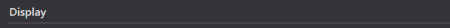

**XML:**

```xml
<option name="separator" id="separator" type="separator"/>
<option name="separator" id="separator" type="separator">Traction Loss Configuration</option>
```

**Parse:** none.

```cpp
if (strcmp(type, "separator") == 0) continue;
```

---

### `static` — *(UI-only)* plain text

Displays the value as plain (non-editable) text.

**UI:**


**XML:**

```xml
<option name="firmware version" type="static">0.5.0.2</option>
```

**Parse:** none.

```cpp
if (strcmp(type, "static") == 0) continue;
```

---

### `link` — *(UI-only)* hyperlink

Displays a clickable link: `name` = link label, value = URL.

**UI:**

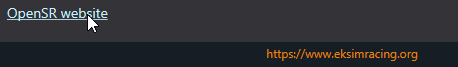

**XML:**

```xml
<option name="OpenSR website" type="link">https://www.eksimracing.org</option>
```

**Parse:** none.

```cpp
if (strcmp(type, "link") == 0) continue;
```

---

### XML parser

OpenSR uses [**tinyxml2**](https://github.com/leethomason/tinyxml2) by [Lee Thomason](https://github.com/leethomason) (Zlib license) for XML parsing.
