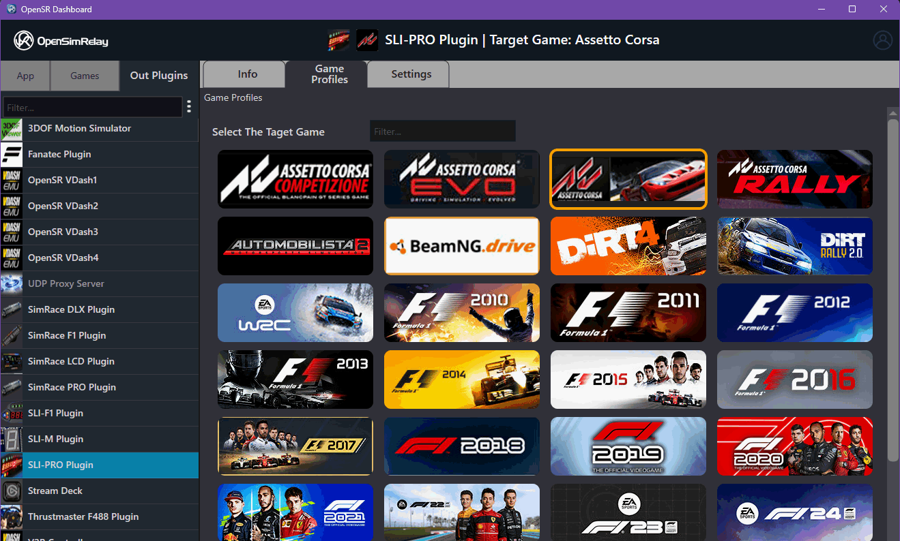
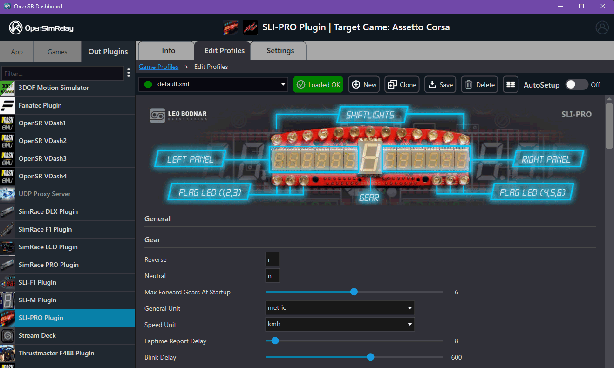

# Profiles & Plugin Grouping

## 1. Overview

[](assets/game_profiles_mgr1.png)

[](assets/game_profiles_mgr2.png)

OpenSR uses a **hierarchical game profile system** to manage configurations across:

- OUT plugins (devices / protocols)
- IN plugins (games)

This system allows:

- per-device configuration
- per-game customization
- profile sharing across compatible plugins

---

## 2. Plugin Identity & Grouping

Each plugin defines its identity via:

```
GetPluginGroupName(...)
```

### Behavior:

#### Case 1 — Empty string (`""`)

- The system uses:
  - **compiled plugin name (without extension)**

Example:

```
rFactor2Plugin.osri → rFactor2Plugin
SLIPROdevicePlugin.osro → SLIPROdevicePlugin
```

This name becomes:

- the **plugin identifier**
- the **profile folder name**

---

#### Case 2 — Custom group name

- The provided string is used instead
- Allows multiple plugins to share:
  - the same profile set

### Example use case:

- Variants of the same game:
  - standard
  - demo
  - AVX version

All can share (example for AMS2, AMS2 Demo and AVX variations):

```
Automobilista2Plugins
```

*In your plugin header:*

```cpp
void GetPluginGroupName(wchar_t* buffer, size_t bufferSize) const override {
        wcscpy_s(buffer, bufferSize, L"Automobilista2Plugins");
}
```

---

## 3. Profile Folder Structure

All profiles are located under:

```
<USER-DOCUMENTS>/OpenSR/Profiles/
```

### Structure:

```
Profiles/
  <OutPluginName>/
    <GamePluginName>/
      profile1.xml
      profile2.xml
      .osr/   (internal host-managed data)
```

---

### Example:

```
Profiles/
  SLIPROdevicePlugin/
    rFactor2Plugin/
      default.xml
      custom.xml
      .osr/
```

---

## 4. Mapping Logic

### Hierarchy:

```
OUT Plugin → Game Plugin → Profiles
```

### Meaning:

- Each **OUT plugin** has its own configuration space
- Inside it:
  - configurations are split per **game (IN plugin)**

---

### Resolution flow:

1. OUT plugin identifies itself → `OutPluginName`
2. IN plugin identifies itself → `GamePluginName`
3. Host loads profiles from:

```
Profiles/<OutPluginName>/<GamePluginName>/
```

---

## 5. Hidden `.osr` Folder

Each OUT plugin profile directory contains:

```
.osr/
```

### Managed exclusively by the host

### Contains:

- default profile reference
- last loaded profile
- autosetup profile

---

### Autosetup behavior:

- Automatically loaded when:
  - a game is detected
- Allows seamless user experience without manual selection

---

## 6. Profile Ownership & Access

### Host responsibilities:

- Create profile folders
- Load and save profiles
- Manage `.osr` internal state
- Handle autosetup logic

### Plugin responsibilities:

- Define:
  - structure (via `profile_template.xml`)
- Consume:
  - configuration data provided by the host

---

## 7. Profile Sharing

### Supported:

Multiple plugins can share the same group name:

- They will:
  - use the same profile folder
  - access the same configurations

### Requirement:

- Plugins must be **fully compatible** with shared profiles

---

## 8. Lifecycle & Loading Behavior

- Profiles are:
  - loaded by the **host**
- Not directly handled by plugins as files

### Typical behavior:

- Loaded:
  - when game starts
  - when user switches profile
- Managed dynamically by the dashboard

---

## 9. Design Intent

- Decouple:
  - device configuration (OUT)
  - game telemetry (IN)
- Allow:
  - reuse across similar plugins
  - scalable configuration system
- Centralize:
  - profile management in the host
